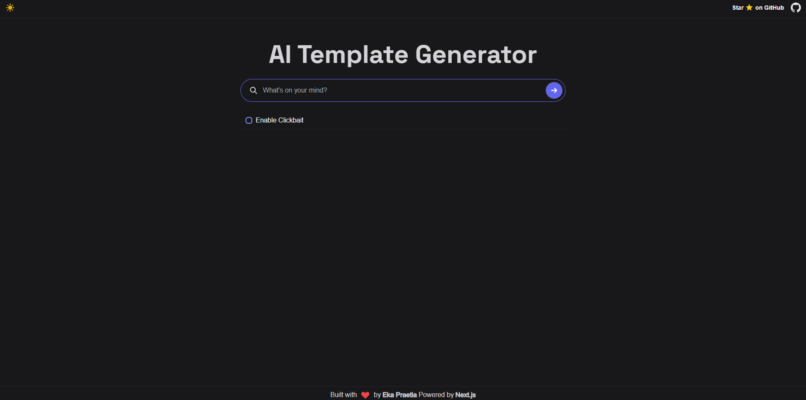
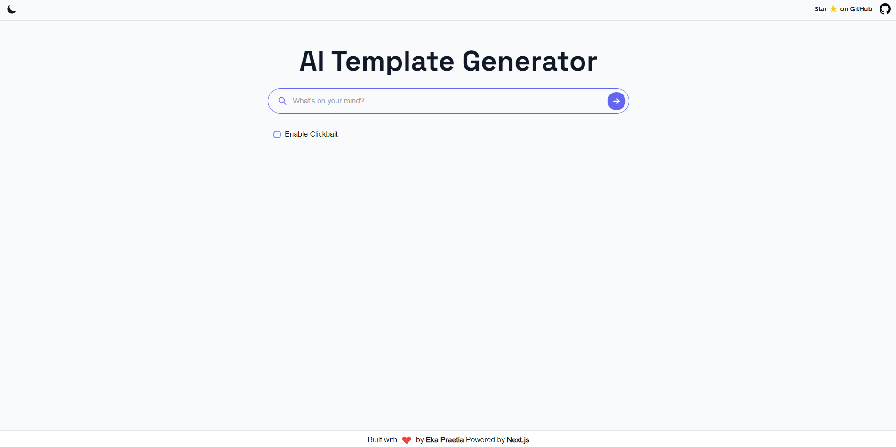

 

 

## [App AI Template](https://www.ekaai.com/)

This simple tool generates article ideas for your blog or website. It's a great way to get started with your content marketing strategy.

## How to use

1. Go to [https://www.ekaai.com/](https://www.ekaai.com/)
2. Enter any related keyword to the topic you have in mind and click `Enter.`  
`Optional`: click on the `Enable CLickbait` to get some ideas that would easily rank on search engines
3. Four different article ideas will be generated; copy any of the generated article idea
4. Paste it into your favourite content editor
5. Write your article
6. Publish it

## How it works

The [OpenAI GPT-3 API](https://openai.com/api/) (text-davinci-003) and [Vercel Edge streaming](https://vercel.com/features/edge-functions) features are used in this application. Based on the user's input, it creates a prompt, sends it to the GPT-3 API using a Vercel Edge function, and streams the response back to the application.

## Running Project Locally

1. Fork the repo
2. Clone the repo
3. After cloning the repo, go to [OpenAI](https://beta.openai.com/account/api-keys) to make an account and generate your API key
4. Rename the `.env.example` file on the root of the project to `.env`, then paste your API key in the `.env` file
5. Run `npm install` to install all the dependencies
6. Run `npm run dev` to start the project
7. Go to [http://localhost:3000](http://localhost:3000) to see the project running

## Contributing

If you want to contribute to this project, please read the [contributing guide](./CONTRIBUTING.md). If you have any ideas or suggestions, feel free to open an issue or a pull request. 

If you like this project, please give it a star ⭐️

## Contributors 💪

Thanks for spending your time helping `AI Template` grow. Happy Hacking 🍻

## Stargazers ⭐️

## Acknowledgement

Built with 💗 by [Eka Prasetia](https://twitter.com/twekaone), powered by [Open AI](https://openai.com/) & [Vercel Edge Functions](https://vercel.com).
